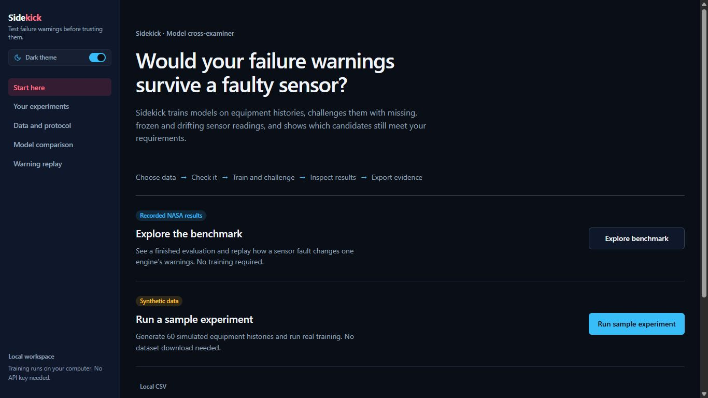
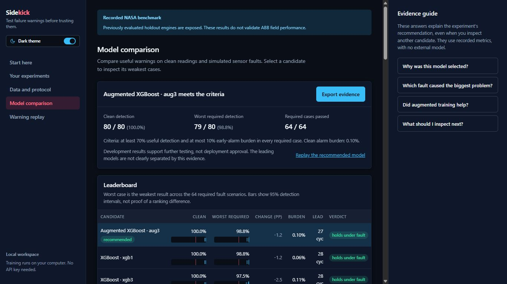
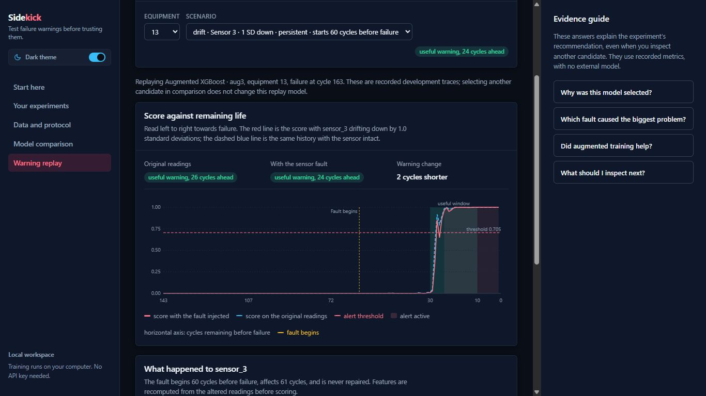

# Sidekick

Sidekick tests whether equipment failure-warning models still work when sensor readings go missing, freeze or drift. Choose data and acceptance limits, train candidate models, inspect their warnings, and export the evidence.

Built for Theme 1 of ABB Accelerator 2026 by Adam Qablawi and Kareem Massoud.

[Public demo](https://sidekick-e9lu.onrender.com/) · [Demo walkthrough](SUBMISSION.md#live-presentation-walkthrough)

## What it does

- Explores a recorded NASA C-MAPSS evaluation.
- Runs real training on synthetic equipment histories.
- Accepts CSV uploads locally, with column mapping and failure-history validation.
- Compares logistic regression, XGBoost, fault-augmented XGBoost and an age baseline.
- Replays original and faulted sensor readings alongside the model's warnings.
- Answers four Evidence guide questions using the selected experiment's recorded metrics.
- Exports an HTML report, JSON evidence, CSV metrics and provenance in a ZIP. Raw uploaded readings are excluded.

No API key is needed. Sidekick does not certify models, approve deployment or monitor live equipment.

## Recorded benchmark

These results come from 80 development histories in NASA's simulated FD001 dataset. They are model-selection results, not independent field validation. Previously examined holdout histories remain identified as exposed.

| Configuration | Clean useful detection | Worst required useful detection | Clean early-alarm burden |
|---|---|---|---|
| Logistic regression `lr2` | 80/80 | 41/80 (51.25%) | 0.00% |
| XGBoost `xgb1` | 80/80 | 79/80 (98.75%) | 0.06% |
| Augmented XGBoost `aug3` | 80/80 | 79/80 (98.75%) | 0.10% |

For `lr2`, the weakest required case is sensor 8 dropout: 41 histories were warned in time, 24 were warned late and 15 were missed. The strongest ordinary and augmented XGBoost configurations have the same worst-case detection. Augmentation's mean required-case advantage is only 0.04 percentage points in this comparison; it is not a controlled test of augmentation.

The bundle contains 256 unique fault scenarios, including 64 required cases, and 2,570 result records across ten model configurations. See [the evidence bundle](evidence/bundle.json) for the original identifiers and metrics.





## Run locally

Requires Python 3.11+ and Node.js 20+.

In PowerShell, from the repository folder:

```powershell
.\tasks.ps1 setup
.\tasks.ps1 build
$env:SIDEKICK_MODE = 'full'
.\tasks.ps1 api
```

Open [http://127.0.0.1:8000](http://127.0.0.1:8000). After installation, only the last two commands are needed. Keep the terminal open; press Ctrl+C to stop the server.

On macOS or Linux:

```bash
make setup
make build
SIDEKICK_MODE=full make api
```

For frontend development, run `.\tasks.ps1 web` or `make web` in a separate terminal. The built app only needs the API server.

## Try an experiment

Choose **Run sample experiment**, then **Generate sample data**. Review the equipment split and demonstration defaults of 70% useful detection and 10% early-alarm burden. Select **Train and challenge models**. When the run finishes, inspect the comparison, try an Evidence guide question, replay a warning and export the evidence.

The local sample has 60 histories and ten model configurations. The free hosted version uses 30 shorter histories, three sensors and four configurations. Both reserve 20 histories without automatically scoring them. A run where no candidate qualifies is a valid result.

CSV uploads are local only. Supply at least 25 complete equipment histories with IDs, integer cycle indices, numeric sensors and failure information. If no failure-cycle column exists, explicitly confirm that histories reach failure. This version does not support censored histories.

## Limits

Useful detection means an alert is active between 10 and 30 operating cycles before failure. Early-alarm burden measures time spent in alarm more than 45 cycles before failure. These demonstration limits are not plant-safety standards, and cycles are not hours.

Development results also select thresholds and configurations, so their performance can be optimistic. Injected faults are not calibrated to ABB field measurements. Feature contributions describe model scores, not physical fault diagnoses.

The public service can sleep or reach its shared training allowance. Results belong to the browser that created them and expire after 24 hours; restarts or idle shutdowns may clear them sooner. Export results promptly. The recorded benchmark remains separate from experiments.
