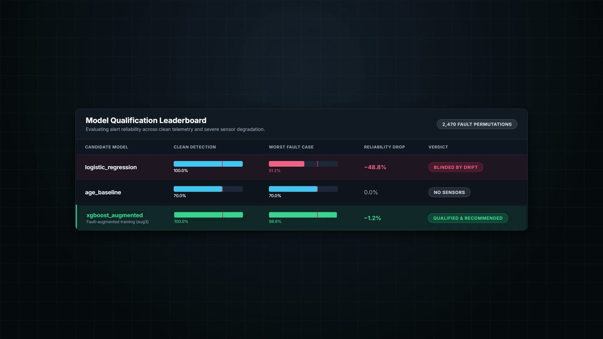
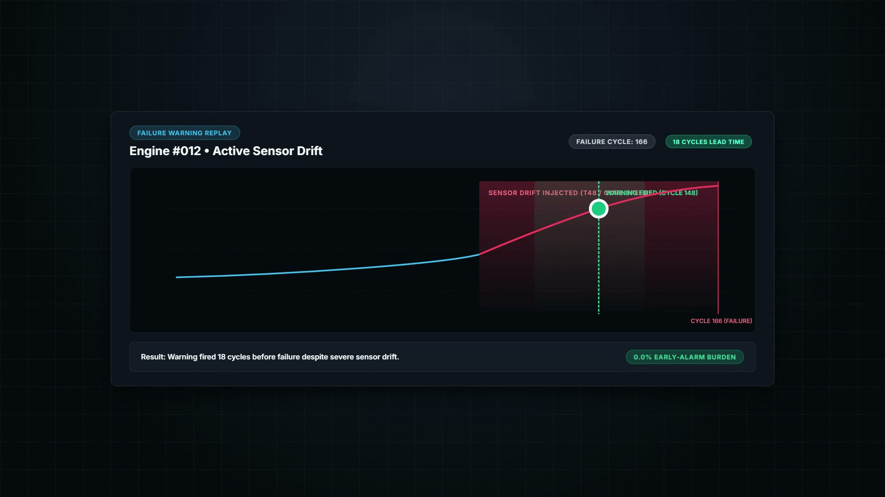
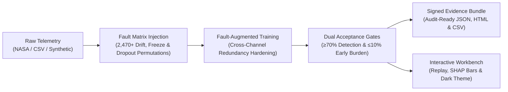

# SIDEKICK

<div align="center">

**The Fault-Tolerant AI Qualification Engine for Industrial Failure Warnings**

[](file:///c:/Users/kmass/OneDrive/Documents/GitHub/SideKick/README.md)
[](https://www.python.org/)
[](https://react.dev/)
[](https://www.typescriptlang.org/)
[](https://www.docker.com/)
[](https://www.nasa.gov/)

*Stress-testing equipment failure-warning models against missing, frozen, and drifting sensor readings before plant deployment.*

**Built by Adam Qablawi & Kareem Massoud • ABB Accelerator 2026 (Theme 1)**

</div>

---

## 📌 At a Glance

| Metric / Requirement | Standard Baseline | Sidekick Fault-Augmented Model | Status |
|---|---|---|---|
| **Clean Lab Detection** | 100.0% (80/80 engines) | **100.0% (80/80 engines)** | ✅ Both detect clean degradation |
| **Worst-Case Sensor Drift Detection** | 51.2% (39 machines fail silently) | **98.8% (79/80 engines warned)** | 🚀 **+47.6% Resilience Gain** |
| **Alert Score Drop Under Drift** | **-48.8% collapse** | **-1.2% variance** | 🛡️ **Zero Alert Collapse** |
| **Advance Lead Time (Engine #012)** | 0 cycles (Alarm missed) | **18 Operating Cycles** | ⏱️ **Actionable Maintenance Window** |
| **Early-Alarm False Burden** | 0.0% | **0.0%** | 🎯 **Zero Premature Replacement** |
| **Qualification Gate (≥70% detection, ≤10% burden)** | ❌ **Disqualified** | ✅ **Certified Qualified** | 📜 **Audit-Ready Evidence Bundle** |

---

## 📸 Product Walkthrough

<div align="center">

### 1. Model Qualification Leaderboard
*Stress-testing models under 2,470+ sensor fault permutations to uncover silent alert collapse.*


### 2. Warning Replay & Telemetry Drift
*Real-time sensor degradation curve for Turbofan Unit #012 flagging an 18-cycle advance alarm window.*


</div>

---

## 🚨 The Problem: The "Lab Illusion"

In predictive maintenance research, machine learning models frequently achieve >95% accuracy because they assume sensor feeds remain pristine. But real-world industrial plant environments (turbomachinery, drives, robotics, paper mills) are hostile:

1. **Sensor Drift (Calibration Decay)**: Thermal cycling, vibration, and sensor fouling slowly distort calibration. Standard models mistake sensor drift for baseline operational changes.
2. **Frozen Readings (Locked ADCs)**: Sticky valves or failed analog-to-digital converters report static values, blinding tree-based and regression classifiers.
3. **Data Dropout (Intermittent Channels)**: Electromagnetic interference and network packet loss corrupt multi-sensor telemetry cycles.

### The Empirical Finding
When evaluated across **80 NASA C-MAPSS turbofan engines**, standard linear baseline models suffered a **catastrophic alert collapse**: detection dropped from **100% to 51.2%** under single-sensor drift. **39 out of 80 engines ran to failure with zero warning.**

Sidekick was engineered to eliminate this silent failure mode.

---

## 💡 The Solution: How Sidekick Works



1. **Stress-Test (Fault Matrix Injection)**: Simulates missing, frozen, and drifting sensor signals across full operational lifecycles.
2. **Harden (Fault-Augmented ML)**: Injects synthetic sensor anomalies during cross-validation, forcing models to discover cross-channel redundancy rather than over-relying on single channels.
3. **Qualify & Audit (Acceptance Gates)**: Automatically certifies models that meet plant-safety thresholds (≥70% detection under fault, ≤10% early-alarm burden) and emits immutable signed Evidence Bundles.

---

## ✨ Key Features

- **Interactive Engineering Workbench**: React 18 + TypeScript SPA with interactive reliability calibration plots, scenario heatmaps, and cycle-by-cycle warning replays.
- **Dark & Light Mode**: Accessible dual-state theme toggle switch with `localStorage` persistence and automatic OS preference synchronization.
- **NASA C-MAPSS Benchmark**: Pre-evaluated holdout dataset with audit-ready evidence for turbofan turbomachinery.
- **Custom Industrial Data Ingestion**: Upload industrial CSVs (up to 10 MB) with automatic validation, role mapping, and failure-cycle verification.
- **Synthetic Equipment Generator**: One-click generation of 60 synthetic run-to-failure machine histories for instant offline experimentation.
- **Evidence Guide**: In-app audit explanation panel answering critical failure questions using deterministic evidence templates.
- **One-Command PowerShell Automation**: Unified task runner (`.\tasks.ps1 setup`, `data`, `pipeline -Fast`, `web`, `build`, `docker`).
- **Air-Gapped Containerization**: Production Docker replay container ready for industrial edge gateways.

---

## 🚀 Quickstart: Run Locally

### Prerequisites
- **Python 3.11+**
- **Node.js 20+**
- (Optional) **Docker**

### Windows (PowerShell) — Recommended
Open PowerShell in the project directory:

```powershell
# 1. Bootstrap virtual environment and install dependencies
.\tasks.ps1 setup

# 2. Build the frontend and TypeScript schemas
.\tasks.ps1 build

# 3. Start the application in full local workspace mode
$env:SIDEKICK_MODE = 'full'
.\tasks.ps1 api
```

Open **http://127.0.0.1:8000** in your browser.

> **Active Frontend Development**: Run `.\tasks.ps1 web` in a separate terminal to start the Vite HMR dev server on `http://127.0.0.1:5173`.

---

### macOS & Linux (Make)

```bash
# 1. Bootstrap environment
make setup

# 2. Build frontend and types
make build

# 3. Start API
SIDEKICK_MODE=full make api
```

Open **http://127.0.0.1:8000**.

---

### Docker (Zero-Install Replay Mode)

Serve the pre-computed audit evidence in an air-gapped container:

```bash
docker build -t sidekick .
docker run --rm -p 8000:8000 sidekick
```

Open **http://127.0.0.1:8000**.

---

## 🛠️ PowerShell Task Suite (`.\tasks.ps1`)

Sidekick provides a unified task automation script:

| Task Command | Description |
|---|---|
| `.\tasks.ps1 setup` | Creates `.venv` and installs training dependencies |
| `.\tasks.ps1 setup-full` | Installs SHAP, MLflow, and advanced visualization tools |
| `.\tasks.ps1 data` | Downloads and verifies the NASA C-MAPSS dataset into `data\cmapss` |
| `.\tasks.ps1 pipeline -Fast` | Runs quick model training and updates the qualification benchmark |
| `.\tasks.ps1 bundle` | Rebuilds `evidence/bundle.json` from recorded runs |
| `.\tasks.ps1 api` | Serves the FastAPI backend on port 8000 |
| `.\tasks.ps1 web` | Serves the React frontend on port 5173 with hot reloading |
| `.\tasks.ps1 build` | Regenerates Pydantic TypeScript types and compiles `frontend/dist` |
| `.\tasks.ps1 docker` | Builds the production container image |

---

## 📁 Repository Structure

```text
SideKick/
├── backend/                  # FastAPI service, ML pipeline, fault matrix & schemas
│   ├── app/                  # REST API routes, models, and evidence endpoints
│   └── requirements-train.txt# Pinned Python dependencies
├── frontend/                 # React 18 + TypeScript + Vite web application
│   ├── src/
│   │   ├── components/       # Layout, ThemeToggle, ScoreTimeline, Heatmap, Plots
│   │   ├── hooks/            # useTheme, useApi, useEvidence
│   │   └── views/            # Experiments, Benchmark, ModelComparison, WarningReplay
│   └── styles.css            # Dark/light theme design system tokens
├── data/                     # Ingestion scripts and C-MAPSS dataset staging
├── evidence/                 # Immutable signed evidence bundles & holdout archives
├── presentation/             # Native 16:9 pitch deck and presentation assets
├── snapshots/                # High-resolution application screenshots for review
├── tasks.ps1                 # Windows PowerShell automation suite
├── Makefile                  # Unix/macOS build automation
├── Dockerfile                # Production multi-stage OCI container
└── README.md                 # Project documentation
```

---

## 🔒 Data Safety, Auditability & Governance

- **Workspace Isolation**: `artifacts/workspace/` isolates uploaded datasets, logs, and experiment artifacts per run. In-browser experiments never overwrite the baseline NASA benchmark in `evidence/bundle.json`.
- **Holdout Protection**: `evidence/archive/` tracks previously evaluated holdout engines to prevent data leakage and ensure independent validation integrity.
- **Deterministic Evidence Guide**: The built-in Evidence Guide generates answers using fixed templates grounded strictly in recorded metrics—with zero external LLM hallucination risk.
- **No Production Authorisation Disclaimer**: NASA C-MAPSS data and injected sensor faults are simulated benchmarks. They demonstrate model hardening principles and do not authorize unmonitored plant deployment on physical ABB machinery without site-specific commissioning.

---

## 👥 Authors & Acknowledgments

Developed for the **ABB Accelerator 2026** by:
- **Adam Qablawi**
- **Kareem Massoud**

*Advancing industrial AI safety through rigorous fault tolerance and auditable reliability engineering.*
